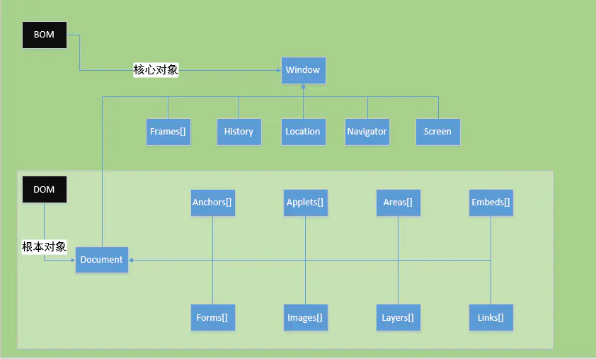
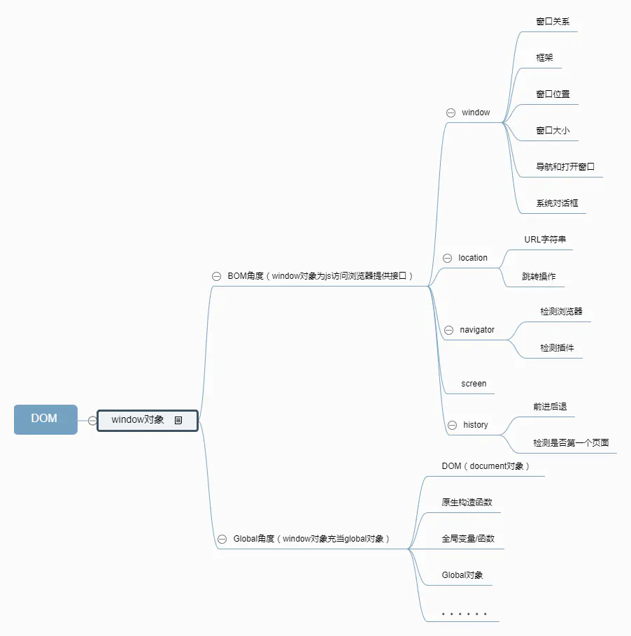

> javascript是由三部分构成：ECMAScript、DOM、BOM

# BOM、DOM概念
## BOM
1. BOM（Browser Object Model，浏览器对象模型）；
2. BOM使JavaScript有能力与浏览器"对话"，即BOM定义了JavaScript可以操作浏览器的各个功能部件的接口；
3. BOM的最根本(最核心)对象是window；
4. BOM没有相关标准，不同的浏览器实现的同一功能可以不同；
5. BOM包含了DOM（window.document），访问浏览器API的是BOM对象，从BOM对象再访问到DOM对象；
## DOM
1. DOM（Document Object Model，文档对象模型）；
2. DOM与文档（网页）有关，与浏览器无关，DOM关注的是网页本身的内容；
3. 由于DOM与浏览器无关，所以标准就好定了，DOM是W3C的标准；
4. DOM最根本对象是document（实际上是window.document）；

# BOM、DOM关系

    

    

# BOM
## Window对象
1. Window对象概念
    * 所有浏览器都支持window对象，它表示浏览器窗口；
    * 所有JavaScript全局对象、函数、变量均自动成为window对象的成员；
    * **全局变量是window对象的属性**；
    * **全局函数是window对象的方法**；
    * 甚至HTML DOM的document也是window对象的属性之一；
2. Window对象属性
    属性|描述
    |:-|:-|
    name|设置或返回窗口的名称，如：`window.name = "新窗口"`；
    closed|返回窗口是否已被关闭，如：`window.closed`；
    defaultStatus|设置或返回窗口状态栏中的默认文本，在IE、Firefox、Chrome、Safari默认配置是不能正常工作；
    length|设置或返回窗口中的框架数量，如：`window.length`；
    innerHeight|返回窗口的文档显示区的高度，如：`window.innerHeight`；
    innerWidth|返回窗口的文档显示区的宽度，如：`window.innerWidth`；
    outerHeight|返回窗口的外部高度，包含工具条与滚动条，如：`window.outerHeight`；
    outerWidth|返回窗口的外部宽度，包含工具条与滚动条，如：`window.outerWidth`；
    pageXOffset|设置或返回当前页面相对于窗口显示区左上角的X位置；
    pageYOffset|设置或返回当前页面相对于窗口显示区左上角的Y位置；
    screenLeft|返回相对于屏幕窗口的x坐标；
    screenTop|返回相对于屏幕窗口的y坐标；
    screenX|返回相对于屏幕窗口的x坐标；
    screenY|返回相对于屏幕窗口的y坐标；
    self|返回对当前窗口的引用，等价于Window属性；
    status|设置窗口状态栏的文本；
    parent|返回父窗口；
    top|返回最顶层的父窗口；
    opener|返回对创建此窗口的窗口的引用；
    **screen**|对 Screen 对象的只读引用，[查看Screen对象](#screen-object)；
    **history**|对History对象的只读引用，[查看History对象](#history-object)；
    **navigator**|对Navigator对象的只读引用，[查看Navigator对象](#navigator-object)；
    **location**|用于窗口或框架的Location对象，[查看Location对象](#location-object)；
    **document**|对Document对象的只读引用，[查看Document对象](#document-object)；
    **frames**|返回窗口中所有命名的框架，该集合是Window对象的数组，每个Window对象在窗口中含有一个框架；
    localStorage|在浏览器中存储key/value对，没有过期时间，[查看localStorage对象](#storage-object)；
    sessionStorage|在浏览器中存储key/value对，在关闭窗口或标签页之后将会删除这些数据，[查看localStorage对象](#storage-object)；
3. Window对象方法
    方法|描述
    |:-|:-|
    alert()|显示带有一段消息和一个确认按钮的警告框；
    atob()|解码一个base-64编码的字符串；
    btoa()|创建一个base-64编码的字符串；
    blur()|把键盘焦点从顶层窗口移开；
    clearInterval()|取消由setInterval()设置的 timeout；
    clearTimeout()|取消由setTimeout()方法设置的 timeout；
    close()|关闭浏览器窗口；
    confirm()|显示带有一段消息以及确认按钮和取消按钮的对话框；
    createPopup()|创建一个pop-up窗口，只有IE浏览器支持该方法；
    focus()|把键盘焦点给予一个窗口；
    getSelection()|返回一个Selection对象，表示用户选择的文本范围或光标的当前位置；
    getComputedStyle()|获取指定元素的CSS样式，如：`window.getComputedStyle(elem, null).getPropertyValue("background-color");`； **window.getComputedStyle()与elem.style的异同：** 相同点： ①二者返回的都是CSSStyleDeclaration对象； ②取属性值时都是采用的CSS驼峰式写法； 不同点： ①elem.style读取的只是元素的内联样式，即元素的style属性上的样式；而getComputedStyle读取的样式是最终样式，包括了内联样式、嵌入样式和外部样式； ②elem.style既支持读也支持写，而getComputedStyle仅支持读并不支持写入；
    matchMedia()|该方法用来检查media query语句，它返回一个MediaQueryList对象；
    moveBy()|可相对窗口的当前坐标把它移动指定的像素，如：`myWindow.moveBy(100, 100); // myWindow窗口横坐标移动100px，纵坐标移动100px`；
    moveTo()|把窗口的左上角移动到一个指定的坐标，如：`myWindow.moveTo(100, 100); // myWindow窗口左上角移动到(100, 100)的位置`；
    open()|打开一个新的浏览器窗口或查找一个已命名的窗口； 语法：`window.open(URL?,name/target?,specs?,replace?)`； **URL**：打开指定页面的URL,如果没有指定URL，则打开空白窗口； **name/target**：指定窗口名称或target属性(①_blank：URL加载到一个新的窗口(默认)，②_parent：URL加载到父框架，③_self：URL替换当前页面；④_top：URL替换任何可加载的框架集)； **specs**：设置打开窗口的大小、位置等，如：width、height、left等 **replace**：①true：URL替换浏览历史中的当前条目，②false：URL在浏览历史中创建新的条目； 如：`window.open("https://www.baidu.com", "_blank", "width=500,height=500");`
    print()|打印当前窗口的内容，如：`window.print();`；
    prompt()|显示可提示用户输入的对话框，语法：`prompt(msg, defaultText)`；
    resizeBy()|按照指定的像素调整窗口的大小；
    resizeTo()|把窗口的大小调整到指定的宽度和高度；
    scroll()|已废弃，该方法已经使用了 scrollTo() 方法来替代；
    scrollBy()|按照指定的像素值来滚动内容；
    scrollTo()|把内容滚动到指定的坐标；
    setInterval()|按照指定的周期（以毫秒计）来调用函数或计算表达式；
    setTimeout()|在指定的毫秒数后调用函数或计算表达式；
    stop()|停止页面载入；
    postMessage()|安全地实现跨源通信；

## Screen对象
1. Screen对象概念
    * Screen对象包含有关客户端显示屏幕的信息；
    * 注：没有应用于screen对象的公开标准，不过所有浏览器都支持该对象；
2. Screen对象属性
    属性|说明
    |:-|:-|
    availWidth|返回屏幕的宽度（不包括Windows任务栏）；
    availHeight|返回屏幕的高度（不包括Windows任务栏）；
    width|返回屏幕的总宽度；
    height|返回屏幕的总高度；
    colorDepth|返回目标设备或缓冲器上的调色板的比特深度；
    pixelDepth|返回屏幕的颜色分辨率（每象素的位数）；

## History对象
1. History对象概念
    * History对象包含用户（在浏览器窗口中）访问过的URL；
    * History对象是window对象的一部分，可通过window.history属性对其进行访问；
    * 注：没有应用于History对象的公开标准，不过所有浏览器都支持该对象；
2. History对象属性
    属性|说明
    |:-|:-|
    length|返回历史列表中的网址数；
3. History对象方法
    方法|说明
    |:-|:-|
    back()|加载history列表中的前一个URL；
    forward()|加载history列表中的下一个URL；
    go()|加载history列表中的某个具体页面，语法：history.go(number\|URL)，如：`window.history.go(-2); // 后退两次`；

## Location对象
1. Location对象概念
    * Location对象包含有关当前URL的信息；
    * Location对象是window对象的一部分，可通过window.Location属性对其进行访问；
    * 注：没有应用于Location对象的公开标准，不过所有浏览器都支持该对象；
2. Location 对象属性
    属性|描述
    |:-|:-|
    hash|返回一个URL的锚部分；
    host|返回一个URL的主机名和端口；
    hostname|返回URL的主机名；
    href|返回完整的URL；
    pathname|返回的URL路径名；
    port|返回一个URL服务器使用的端口号；
    protocol|返回一个URL协议；
    search|返回一个URL的查询部分；
3. Location 对象方法
    方法|说明
    |:-|:-|
    assign()|载入一个新的文档，如：`window.location.assign("https://www.baidu.com")`；
    reload()|重新载入当前文档； 语法：`window.location.reload(forceGet: boolean)` forceGet=true时，则会绕过缓存，从服务器上重新下载该文档；
    replace()|用新的文档替换当前文档，如：`window.location.replace("https://www.baidu.com")`；

## Navigator对象
1. Navigator对象概念
    * Navigator对象包含有关浏览器的信息；
    * 注：没有应用于navigator对象的公开标准，不过所有浏览器都支持该对象；
2. Navigator对象属性
    属性|说明
    |:-|:-|
    appCodeName|返回浏览器的代码名；
    appName|返回浏览器的名称；
    appVersion|返回浏览器的平台和版本信息；
    cookieEnabled|返回指明浏览器中是否启用cookie的布尔值；
    platform|返回运行浏览器的操作系统平台；
    userAgent|返回由客户机发送服务器的user-agent头部的值；
3. Navigator对象方法
    方法|描述
    |:-|:-|
    javaEnabled()|指定是否在浏览器中启用Java；
    taintEnabled()|规定浏览器是否启用数据污点(data tainting)，目前只有Internet Explorer、Opera浏览器支持该方法；

## 存储对象
1. 存储对象概念
    * Web存储API提供了sessionStorage（会话存储）、localStorage（本地存储）两个存储对象来对网页数据进行添加、删除、修改、查询操作；
2. 存储对象属性
    属性|描述
    |:-|:-|
    length|返回存储对象中包含多少条数据；
3. 存储对象方法
    方法|描述
    |:-|:-|
    key(n)|返回存储对象中第n个键的名称；
    getItem(keyname)|返回指定键的值；
    setItem(keyname, value)|添加键和值，如果对应的值存在，则更新该键对应的值；
    removeItem(keyname)|移除键；
    clear()|清除存储对象中所有的键；

## Cookies对象
1. Cookies对象概念
    * Cookies是一些数据, 并存储于你电脑上的文本文件中；
    * 当web服务器向浏览器发送web页面时，在连接关闭后，服务端不会记录用户的信息，**Cookies的作用就是用于解决 "如何记录客户端的用户信息"**：
        * 当用户访问web页面时，名字可以记录在cookie中；
        * 在用户下一次访问该页面时，可以在cookie中读取用户访问记录；
    * Cookies以名/值对形式存储，如：username=John Doe；
    * 当浏览器从服务器上请求web页面时，属于该页面的cookies会被添加到该请求中，服务端通过这种方式来获取用户的信息；
2. 创建Cookie
    * 创建cookie：`document.cookie="username=John Doe"`；
    * 为cookie添加过期时间（以UTC或GMT时间），默认情况下，cookie在浏览器关闭时删除：`document.cookie="username=John Doe; expires=Thu, 18 Dec 2013 12:00:00 GMT"`；
    * 为cookie添加path参数，告诉浏览器cookie的路径，默认情况下，cookie属于当前页面：`document.cookie="username=John Doe; expires=Thu, 18 Dec 2013 12:00:00 GMT; path=/"`；
    * 新创建的cookie会添加了cookie中，旧的cookie不会被覆盖；
3. 读取Cookie
    * 读取cookies：`var x = document.cookie; // "cookie1=value; cookie2=value"`，
4. 修改Cookie
    * 修改cookies类似于创建cookies，旧的cookie将被覆盖：`document.cookie="username=John Smith; expires=Thu, 18 Dec 2013 12:00:00 GMT; path=/"`；
5. 删除Cookie
    * 只需要设置expires参数为以前的时间即可，不必指定cookie的值，如：`document.cookie = "username=; expires=Thu, 01 Jan 1970 00:00:00 GMT"`;

## sessionStorage、localStorage、Cookies的区别
1. 相同点：都是保存在浏览器端、且同源的 
2. 不同点： 
    * **cookie数据始终在同源的http请求中携带（即使不需要）**，即cookie在浏览器和服务器间来回传递；
        **sessionStorage和localStorage不会自动把数据发送给服务器，仅在本地保存**；
        cookie数据还有路径（path）的概念，可以限制cookie只属于某个路径下；
    * 存储大小限制不同：**cookie数据不能超过4K**，同时因为每次http请求都会携带cookie，所以cookie只适合保存很小的数据，如会话标识；
        **sessionStorage和localStorage**虽然也有存储大小的限制，但比cookie大得多，**可以达到5M或更大**；
    * 数据有效期不同：
        * sessionStorage：仅在当前浏览器窗口关闭之前有效；
        * localStorage：始终有效，窗口或浏览器关闭也一直保存，因此用作持久数据；
        * cookie：只在设置的cookie过期时间之前有效，即使窗口关闭或浏览器关闭；
    * 作用域不同：
        * sessionStorage不在不同的浏览器窗口中共享，即使是同一个页面；
        * localstorage在所有同源窗口中都是共享的；
        * cookie也是在所有同源窗口中都是共享的；

# DOM
## DOM Document对象
1. HTML DOM节点
    在HTML DOM中，每一个元素都是节点:
        * 文档是一个文档节点；
        * HTML元素是元素节点；
        * HTML属性是属性节点；
        * 文本是文本节点；
        * 注释是注释节点；
2. Document对象概念
    * 当浏览器载入HTML文档, 浏览器会创建页面的Document对象，Document对象树如下所示；
        

          
        

    * Document对象是HTML文档的根节点；
    * Document对象使我们可以从脚本中对HTML页面中的所有元素进行访问；
    * Document对象树：
3. Document对象属性和方法
    属性/方法|描述
    |:------|:--|
    `document.activeElement`|返回当前获取焦点元素，如：`document.activeElement.tagName`；
    `document.addEventListener()`|向文档添加句柄，如：`document.addEventListener("click", myFunc);`；
    `document.removeEventListener()`|移除文档中的事件句柄，如：`document.removeEventListener("mousemove", myFunc);`； 注: 如果要移除事件句柄，addEventListener()的执行函数myFunc必须使用外部函数，若为匿名函数，则该事件无法被移除；
    `document.adoptNode(node)`|从另外一个文档返回adapded节点到当前文档，如获取iframe中的h1元素：`var frame = document.getElementsByTagName("IFRAME")[0]; var h = frame.contentWindow.document.getElementsByTagName("H1")[0]; var x = document.adoptNode(h);`
    `document.importNode()`|把一个节点从另一个文档复制到该文档以便应用；
    `document.anchors`|返回对文档中所有Anchor对象的引用，即获取文档中所以锚点；
    `document.applets`|返回对文档中所有Applet对象的引用； **注意: HTML5 已不支持\<applet>元素**；
    `document.baseURI`|返回文档的绝对基础URI；
    `document.body`|返回文档的body元素；
    `document.open()`|打开一个流，以收集来自任何document.write()或document.writeln()方法的输出；
    `document.close()`|关闭用document.open()方法打开的输出流，并显示选定的数据；
    `document.cookie`|设置或返回与当前文档有关的所有cookie；
    `document.createAttribute()`|创建一个属性节点；
    `document.createComment()`|创建一个注释节点；
    `document.createDocumentFragment()`|创建空的DocumentFragment对象，并返回此对象；
    `document.createElement()`|创建一个元素节点；
    `document.createTextNode()`|创建一个文本节点；
    `document.doctype`|返回与文档相关的文档类型声明(DTD)；
    `document.documentElement`|返回文档的根节点；
    `document.documentMode`|返回用于通过浏览器渲染文档的模式；
    `document.documentURI`|设置或返回文档的位置；
    `document.domain`|返回当前文档的域名；
    `document.domConfig`|**已废弃**，返回normalizeDocument()被调用时所使用的配置；
    `document.embeds`|返回文档中所有\<embeds>元素的集合；
    `document.forms`|返回对文档中所有Form对象引用；
    `document.getElementsByClassName()`|返回文档中所有指定类名的元素集合，作为 NodeList 对象；
    `document.getElementById()`|返回对拥有指定id的第一个对象的引用；
    `document.getElementsByName()`|返回带有指定名称的对象集合；
    `document.getElementsByTagName()`|返回带有指定标签名的对象集合；
    `document.images`|返回对文档中所有Image对象引用；
    `document.implementation`|返回处理该文档的DOMImplementation对象；
    `document.inputEncoding`|返回用于文档的编码方式（在解析时），如：`document.inputEncoding; // 返回UTF-8`；
    `document.lastModified`|返回文档被最后修改的日期和时间；
    `document.links`|返回对文档中所有Area、Link对象引用；
    `document.normalize()`|合并相邻的文本节点，并删除空的文本节点；
    `document.normalizeDocument()`|删除空文本节点，并连接相邻节点的，目前没有主流浏览器支持；
    `document.querySelector()`|返回文档中匹配指定的CSS选择器的第一元素；
    `document.querySelectorAll()`|document.querySelectorAll()是HTML5中引入的新方法，返回文档中匹配的CSS选择器的所有元素节点列表；
    `document.readyState`|返回文档状态 (载入中……)；
    `document.referrer`|返回载入当前文档的URL；
    `document.renameNode()`|重命名元素或者属性节点，目前没有主流浏览器支持；
    `document.scripts`|返回页面中所有脚本的集合；
    `document.strictErrorChecking`|设置或返回是否强制进行错误检查，目前所有主流浏览器都不支持；
    `document.title`|返回当前文档的标题；
    `document.URL`|返回文档完整的URL；
    `document.write()`|向文档写HTML表达式、JavaScript代码；
    `document.writeln()`|等同于 write() 方法，不同的是在每个表达式之后写一个换行符；

## DOM元素对象
1. 元素对象：
    * 在HTML DOM中, 元素对象代表着一个HTML元素；
    * 元素对象的子节点可以是元素节点、文本节点、注释节点；
    * NodeList对象代表了节点列表，类似于HTML元素的子节点集合；
2. 属性和方法
    属性/方法|描述
    |:------|:--|
    `element.accessKey`|设置或返回accesskey一个元素；
    `element.addEventListener()`|向指定元素添加事件句柄；
    `element.appendChild()`|为元素添加一个新的子元素；
    `element.attributes`|返回一个元素的属性数组；
    `element.childNodes`|返回元素的一个子节点的数组；
    `element.children`|返回元素的子元素的集合；
    `element.classList`|返回元素的类名，作为DOMTokenList 对象；
    `element.className`|设置或返回元素的class属性；
    `element.clientHeight`|在页面上返回内容的可视高度（不包括边框，边距或滚动条）；
    `element.clientWidth`|在页面上返回内容的可视宽度（不包括边框，边距或滚动条）；
    `element.cloneNode()`|克隆某个元素；
    `element.compareDocumentPosition()`|比较两个元素的文档位置；
    `element.contentEditable`|设置或返回元素的内容是否可编辑；
    `element.dir`|设置或返回一个元素中的文本方向；
    `element.firstChild`|返回元素的第一个子节点；
    `element.focus()`|设置文档或元素获取焦点；
    `element.getAttribute()`|返回指定元素的属性值；
    `element.getAttributeNode()`|返回指定属性节点；
    `element.getElementsByTagName()`|返回指定标签名的所有子元素集合；
    `element.getElementsByClassName()`|返回文档中所有指定类名的元素集合，作为NodeList 对象；
    `element.getFeature()`|返回指定特征的执行APIs对象；
    `element.getUserData()`|返回一个元素中关联键值的对象；
    `element.hasAttribute()`|如果元素中存在指定的属性返回true，否则返回false；
    `element.hasAttributes()`|如果元素有任何属性返回true，否则返回false；
    `element.hasChildNodes()`|返回一个元素是否具有任何子元素；
    `element.hasFocus()`|返回布尔值，检测文档或元素是否获取焦点；
    `element.id`|设置或者返回元素的id；
    `element.innerHTML`|设置或者返回元素的内容；
    `element.insertBefore()`|现有的子元素之前插入一个新的子元素；
    `element.isContentEditable`|如果元素内容可编辑返回true，否则返回false；
    `element.isDefaultNamespace()`|如果指定了namespaceURI返回true，否则返回false；
    `element.isEqualNode()`|检查两个元素是否相等；
    `element.isSameNode()`|检查两个元素所有有相同节点；
    `element.isSupported()`|如果在元素中支持指定特征返回true；
    `element.lang`|设置或者返回一个元素的语言；
    `element.lastChild`|返回的最后一个子节点；
    `element.namespaceURI`|返回命名空间的URI；
    `element.nextSibling`|返回该元素紧跟的一个节点；
    `element.nextElementSibling`|返回指定元素之后的下一个兄弟元素（相同节点树层中的下一个元素节点）；
    `element.nodeName`|返回元素的标记名（大写）；
    `element.nodeType`|返回元素的节点类型；
    `element.nodeValue`|返回元素的节点值；
    `element.normalize()`|使得此成为一个"normal"的形式，其中只有结构（如元素、注释、处理指令、CDATA节和实体引用）隔开Text节点，即元素（包括属性）下面的所有文本节点，既没有相邻的文本节点也没有空的文本节点；
    `element.offsetHeight`|返回任何一个元素的高度包括边框和填充，但不是边距；
    `element.offsetWidth`|返回元素的宽度，包括边框和填充，但不是边距；
    `element.offsetLeft`|返回当前元素的相对水平偏移位置的偏移容器；
    `element.offsetParent`|返回元素的偏移容器；
    `element.offsetTop`|返回当前元素的相对垂直偏移位置的偏移容器；
    `element.ownerDocument`|返回元素的根元素（文档对象）；
    `element.parentNode`|返回元素的父节点；
    `element.previousSibling`|返回某个元素紧接之前元素；
    `element.previousElementSibling`|返回指定元素的前一个兄弟元素（相同节点树层中的前一个元素节点）；
    `element.querySelector()`|返回匹配指定CSS选择器元素的第一个子元素；
    `document.querySelectorAll()`|返回匹配指定CSS选择器元素的所有子元素节点列表；
    `element.removeAttribute()`|从元素中删除指定的属性；
    `element.removeAttributeNode()`|删除指定属性节点并返回移除后的节点；
    `element.removeChild()`|删除一个子元素；
    `element.removeEventListener()`|移除由addEventListener()方法添加的事件句柄；
    `element.replaceChild()`|替换一个子元素；
    `element.scrollHeight`|返回整个元素的高度（包括带滚动条的隐蔽的地方）；
    `element.scrollLeft`|返回当前视图中的实际元素的左边缘和左边缘之间的距离；
    `element.scrollTop`|返回当前视图中的实际元素的顶部边缘和顶部边缘之间的距离；
    `element.scrollWidth`|返回元素的整个宽度（包括带滚动条的隐蔽的地方）；
    `element.setAttribute()`|设置或者改变指定属性并指定值；
    `element.setAttributeNode()`|设置或者改变指定属性节点；
    `element.setIdAttribute()`|
    `element.setIdAttributeNode()`|
    `element.setUserData()`|在元素中为指定键值关联对象；
    `element.style`|设置或返回元素的样式属性；
    `element.tabIndex`|设置或返回元素的标签顺序；
    `element.tagName`|作为一个字符串返回某个元素的标记名（大写）；
    `element.textContent`|设置或返回一个节点和它的文本内容；
    `element.title`|设置或返回元素的title属性；
    `element.toString()`|一个元素转换成字符串；
    `nodelist.item()`|返回某个元素基于文档树的索引；
    `nodelist.length`|返回节点列表的节点数目；

## DOM属性对象
1. Attr对象
    * 在HTML DOM中, Attr对象 代表一个HTML属性；
    * HTML属性总是属于HTML元素；
2. NamedNodeMap对象
    * 在HTML DOM中, the NamedNodeMap对象表示一个无顺序的节点列表；
    * 我们可通过节点名称来访问NamedNodeMap中的节点；
3. 属性和方法
    属性/方法|描述
    |:------|:--|
    `attr.isId`|检查属性是否为元素的ID属性；
    `attr.name`|返回属性名称；
    `attr.value`|设置或者返回属性值；
    `attr.specified`|检查属性是否有指定的值；
    `nodemap.getNamedItem()`|返回节点列表中指定属性名的值，如：`btn.attributes.getNamedItem("onclick").textContent`；
    `nodemap.item()`|返回节点列表中处于指定索引号的节点，如：`document.getElementsByTagName("BUTTON")[0].attributes.item(0).nodeName;`；
    `nodemap.length`|返回节点列表的节点数目，如：`document.getElementsByTagName("BUTTON")[0].attributes.length;`；
    `nodemap.removeNamedItem()`|删除指定属性节点，如：`document.getElementsByTagName("INPUT")[0]; btn.attributes.removeNamedItem("type");`；
    `nodemap.setNamedItem()`|设置指定属性节点(通过名称)，如： `var btn=document.getElementsByTagName("h1")[0];` `var typ=document.createAttribute("class");` `typ.nodeValue="democlass";` `btn.attributes.setNamedItem(typ)`；

## DOM事件对象
1. 事件对象
    * HTML DOM事件允许Javascript在HTML文档元素中注册不同事件处理程序；
    * 事件通常与函数结合使用，函数不会在事件发生前被执行(如用户点击按钮)；
2. 鼠标事件
    属性|描述|DOM
    |:--|:--|:--|
    `onmousedown`|鼠标按钮被按下；|2
    `onmouseup`|鼠标按键被松开；|2
    `onclick`|当用户点击某个对象时调用的事件句柄；|2
    `oncontextmenu`|在用户点击鼠标右键打开上下文菜单时触发；| 
    `ondblclick`|当用户双击某个对象时调用的事件句柄；|2
    `onmouseenter`|当鼠标指针移动到元素上时触发；|2
    `onmouseleave`|当鼠标指针移出元素时触发|2
    `onmousemove`|鼠标被移动；|2
    `onmouseover`|鼠标移到某元素之上；|2
    `onmouseout`|鼠标从某元素移开；|2
3. 鼠标事件
    属性|描述|DOM
    |:--|:--|:--|
    `onkeydown`|某个键盘按键被按下；|2
    `onkeyup`|某个键盘按键被松开；|2
    `onkeypress`|某个键盘按键被按下并松开；|2
4. 框架/对象（Frame/Object）事件
    属性|描述|DOM
    |:--|:--|:--|
    `onabort`|图像的加载被中断；(\<object>)，只有IE浏览器支持；|2
    `onbeforeunload`|在即将离开页面（刷新或关闭）时触发；|2
    `onerror`|在加载文档或图像时发生错误；(\<object>、\<body>、\<frameset>)| 
    `onhashchange`|在当前URL的锚部分发生修改时触发；| 
    `onload`|一张页面或一幅图像完成加载；|2
    `onpageshow`|在用户访问页面时触发；|
    `onpagehide`|在用户离开当前网页跳转到另外一个页面时触发；|
    `onresize`|窗口或框架被重新调整大小；|2
    `onscroll`|当文档被滚动时发生的事件；|2
    `onunload`|用户退出页面； (\<body>、\<frameset>)|2
5. 表单事件
    属性|描述|DOM
    |:--|:--|:--|
    `onfocus`|元素获取焦点时触发；|2
    `onblur`|元素失去焦点时触发；|2
    `onchange`|在表单元素的内容改变时触发(\<input>、\<keygen>、\<select>、\<textarea>)；|2
    `onfocusin`|元素即将获取焦点时触发；|2
    `onfocusout`|元素即将失去焦点时触发；|2
    `oninput`|元素获取用户输入时触发；|3
    `onreset`|表单重置时触发；|2
    `onsearch`|用户向搜索域输入文本时触发(\<input="search">)；| 
    `onselect`|用户选取文本时触发 (\<input>、\<textarea>)；|2
    `onsubmit`|表单提交时触发；|2
6. 剪贴板事件
    属性|描述|DOM
    |:--|:--|:--|
    `oncopy`|在用户拷贝元素内容时触发；|
    `oncut`|在用户剪切元素内容时触发；|
    `onpaste`|在用户粘贴元素内容时触发；|
7. 打印事件
    属性|描述|DOM
    |:--|:--|:--|
    `onafterprint`|在页面已经开始打印，或者打印窗口已经关闭时触发；|
    `onbeforeprint`|在页面即将开始打印时触发；|
8. 拖动事件
    属性|描述|DOM
    |:--|:--|:--|
    `ondrag`|在元素正在拖动时触发；|
    `ondragend`|在用户完成元素的拖动时触发；|
    `ondragenter`|在拖动的元素进入放置目标时触发；|
    `ondragleave`|在拖动元素离开放置目标时触发；|
    `ondragover`|在拖动元素在放置目标上时触发；|
    `ondragstart`|在用户开始拖动元素时触发；|
    `ondrop`|在拖动元素放置在目标区域时触发；|
9. 多媒体（Media）事件
    属性|描述|DOM
    |:--|:--|:--|
    `onabort`|在视频/音频（audio/video）终止加载时触发；|
    `oncanplay`|在用户可以开始播放视频/音频（audio/video）时触发；|
    `oncanplaythrough`|在视频/音频（audio/video）可以正常播放且无需停顿和缓冲时触发；|
    `ondurationchange`|在视频/音频（audio/video）的时长发生变化时触发；|
    `onemptied`|当期播放列表为空时触发；|
    `onended`|在视频/音频（audio/video）播放结束时触发；|
    `onerror`|在视频/音频（audio/video）数据加载期间发生错误时触发；|
    `onloadeddata`|在浏览器加载视频/音频（audio/video）当前帧时触发触发；|
    `onloadedmetadata`|在指定视频/音频（audio/video）的元数据加载后触发；|
    `onloadstart`|在浏览器开始寻找指定视频/音频（audio/video）触发；|
    `onpause`|在视频/音频（audio/video）暂停时触发；|
    `onplay`|在视频/音频（audio/video）开始播放时触发；|
    `onplaying`|在视频/音频（audio/video）暂停或者在缓冲后准备重新开始播放时触发；|
    `onprogress`|在浏览器下载指定的视频/音频（audio/video）时触发；|
    `onratechange`|在视频/音频（audio/video）的播放速度发送改变时触发；|
    `onseeked`|在用户重新定位视频/音频（audio/video）的播放位置后触发；|
    `onseeking`|在用户开始重新定位视频/音频（audio/video）时触发；|
    `onstalled`|在浏览器获取媒体数据，但媒体数据不可用时触发；|
    `onsuspend`|在浏览器读取媒体数据中止时触发；|
    `ontimeupdate`|在当前的播放位置发送改变时触发；|
    `onvolumechange`|在音量发生改变时触发；|
    `onwaiting`|在视频由于要播放下一帧而需要缓冲时触发；|
10. 动画事件
    属性|描述|DOM
    |:--|:--|:--|
    `animationend`|在 CSS 动画结束播放时触发|
    `animationiteration`|在 CSS 动画重复播放时触发|
    `animationstart`|在 CSS 动画开始播放时触发|
11. 过渡事件
    属性|描述|DOM
    |:--|:--|:--|
    transitionend|在 CSS 完成过渡后触发；|
12. 其他事件
    属性|描述|DOM
    |:--|:--|:--|
    `ontoggle`|在用户打开或关闭 \
 元素时触发；|
    `onwheel`|在鼠标滚轮在元素上下滚动时触发；|
13. 事件对象属性
    属性|描述|DOM
    |:--|:--|:--|
    `bubbles`|返回布尔值，指示事件是否是起泡事件类型；|2
    `cancelable`|返回布尔值，指示事件是否可拥可取消的默认动作，即用preventDefault()方法可以取消与事件关联的默认动作，则返回true；|2
    `currentTarget`|返回其事件监听器触发该事件的元素；|2
    `eventPhase`|返回事件传播的当前阶段；|2
    `target`|返回触发此事件的元素（事件的目标节点）；|2
    `timeStamp`|返回事件生成的日期和时间；|2
    `type`|返回当前 Event 对象表示的事件的名称；|2
14. 事件Event对象属性
    属性|描述|DOM
    |:--|:--|:--|
    `bubbles`|返回布尔值，指示事件是否是起泡事件类型；|2
    `cancelable`|返回布尔值，指示事件是否可拥可取消的默认动作，即用preventDefault()方法可以取消与事件关联的默认动作，则返回true；|2
    `currentTarget`|返回其事件监听器触发该事件的元素；|2
    `eventPhase`|返回事件传播的当前阶段；|2
    `target`|返回触发此事件的元素（事件的目标节点）；|2
    `timeStamp`|返回事件生成的日期和时间；|2
    `type`|返回当前 Event 对象表示的事件的名称；|2
15. 事件Event对象方法
    属性|描述|DOM
    |:--|:--|:--|
    `initEvent()`|初始化新创建的 Event 对象的属性；|2
    `preventDefault()`|通知浏览器不要执行与事件关联的默认动作；|2
    `stopPropagation()`|不再派发事件；|2
16. 鼠标/键盘事件Event对象
    属性|描述|DOM
    |:--|:--|:--|
    `altKey`|返回当事件被触发时，"ALT" 是否被按下，如：`event.altKey`；|2
    `button`|返回当事件被触发时，哪个鼠标按钮被点击，如：`event.button; // 0：指定鼠标左键；1：指定鼠标中键；2：指定鼠标右键；`；|2
    `clientX`|返回当事件被触发时，鼠标指针的水平坐标，如：`event.clientX`；|2
    `clientY`|返回当事件被触发时，鼠标指针的垂直坐标，如：`event.clientY`；|2
    `ctrlKey`|返回当事件被触发时，"CTRL" 键是否被按下，如：`event.ctrlKey`；|2
    `Location`|返回按键在设备上的位置；|3
    `charCode`|返回onkeypress事件触发键值的字母代码；|2
    `key`|在按下按键时返回按键的标识符；|3
    `keyCode`|返回onkeypress事件触发的键的值的字符代码，或者 onkeydown 或 onkeyup 事件的键的代码；|2
    `which`|返回onkeypress事件触发的键的值的字符代码，或者 onkeydown 或 onkeyup 事件的键的代码；|2
    `metaKey`|返回当事件被触发时，"meta" 键是否被按下；|2
    `relatedTarget`|返回与事件的目标节点相关的节点；|2
    `screenX`|返回当某个事件被触发时，鼠标指针的水平坐标；|2
    `screenY`|返回当某个事件被触发时，鼠标指针的垂直坐标；|2
    `shiftKey`|返回当事件被触发时，"SHIFT" 键是否被按下；|2

## Console对象
1. Console对象概念
    * Console对象提供了访问浏览器调试模式的信息到控制台；
2. Console对象方法
    方法|描述
    |:--|:--|
    `assert()`|如果断言为false，则在信息到控制台输出错误信息；
    `clear()`|清除控制台上的信息；
    `count()`|记录 count() 调用次数，一般用于计数；
    `error()`|输出错误信息到控制台；
    `group()`|在控制台创建一个信息分组； 一个完整的信息分组以 console.group() 开始，console.groupEnd() 结束；
    `groupCollapsed()`|在控制台创建一个信息分组，类似 console.group() ，但它默认是折叠的；
    `groupEnd()`|设置当前信息分组结束；
    `info()`|控制台输出一条信息；
    `log()`|控制台输出一条信息；
    `table()`|以表格形式显示数据；
    `time()`|计时器，开始计时间，与 timeEnd() 联合使用，用于算出一个操作所花费的准确时间；
    `timeEnd()`|计时结束；
    `trace()`|显示当前执行的代码在堆栈中的调用路径；
    `warn()`|输出警告信息，信息最前面加一个黄色三角，表示警告；

## CSS样式声明对象(CSSStyleDeclaration)
1. CSSStyleDeclaration对象
    * CSSStyleDeclaration对象表示一个 CSS 属性-值（property-value）对的集合；
2. CSSStyleDeclaration对象属性
    属性|描述
    |:--|:--|
    `cssText`|设置或返回样式声明文本，cssText对应的是HTML元素的style属性，如：`elem.style.cssText`；
    `length`|返回样式中包含多少条声明，如：`elem.style.length`；
    `parentRule`|返回包含当前规则的规则；
3. CSSStyleDeclaration对象方法
    方法|描述
    |:--|:--|
    `getPropertyPriority()`|返回指定的 CSS 属性是否设置了 "important!" 属性，如：`elem.style.getPropertyPriority("color")`；
    `getPropertyValue()`|返回指定的 CSS 属性值，如：`elem.style.getPropertyValue("color")`；
    `item()`|通过索引方式返回 CSS 声明中的 CSS 属性名，如：`elem.style.item(0)`；
    `removeProperty()`|移除 CSS 声明中的 CSS 属性，如：`elem.style.removeProperty("color")`；
    `setProperty()`|在 CSS 声明块中新建或者修改 CSS 属性，如：`elem.style.setProperty("background-color", "yellow")`；

## HTMLCollection
1. HTMLCollection概念
    * HTMLCollection是HTML元素的集合；
    * HTMLCollection对象类似一个包含HTML元素的数组列表；
    * getElementsByTagName()方法返回的就是一个HTMLCollection对象；
2. 属性和方法
    属性/方法|描述
    |:--|:--|
    `item()`|返回HTMLCollection中指定索引的元素；
    `length`|返回HTMLCollection中元素的数量；
    `namedItem()`|返回HTMLCollection中指定ID或name属性的元素，语法：HTMLCollection.namedItem(name)或HTMLCollection[name]，如：`document.getElementsByTagName("P")["myElement"]`；

[查看原文](https://www.runoob.com/jsref/obj-window.html)