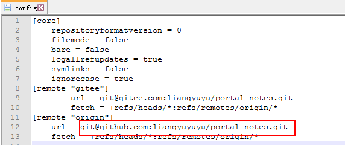
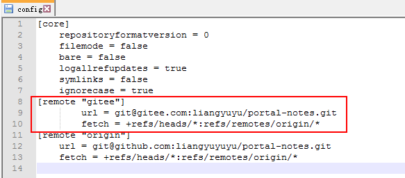

## 更换远程地址的方法
* 通过命令直接修改远程仓库地址：
    ```shell
    git remote 查看所有远程仓库
    git remote xxx 查看指定远程仓库地址
    git remote set-url origin 新的远程仓库地址
    ```
* 先删除再添加你的远程仓库：
    ```shell
    git remote rm origin
    git remote add origin 你的新远程仓库地址
    ```
* 修改本地`.git/config`配置文件：
    <div align="left">
        
    </div>


## 代码同时提交到GitHub、Gitee
* 首先在[Gitee](https://gitee.com/)官网，选择导入GitHub仓库；
* 把代码Clone到本地，克隆GitHub或者克隆Gitee都可以；
* 修改.git/config文件，添加GitHub/Gitee的仓库地址：
    <div align="left">
        
    </div>
* 提交代码时，执行`git push;git push gitee`命令，即可把代码同时提交到GitHub、Gitee；

## Git Bash中给命令起别名
* 设置别名gpull：`alias gpull='git pull origin master;git pull gitee master;'`
* 设置别名gpush：`alias gpull='git push origin master;git push gitee master;'`
* 查看设置的所有别名：`alias`
* 删除别名：`unalias gpull`
* 别名永久生效：
    * 因为命令别名属于内部命令，**一个别名仅在它所被定义的shell进程中才有效**；
    * 如果想要使得设置的别名永久生效，可以把它加入Linux启动文件.bashrc（隐藏文件）或.bash_profile（隐藏文件）中；
        * 注意：修改完成后，需要重新打开shell才能生效；
    ```shell
    # 当前用户生效
    echo 'alias llt='ls -lt'' >> ~/.bashrc
    # 所有用户生效
    echo 'alias llt='ls -lt'' >> /etc/bashrc
    ```
* 取消别名执行：在~/.bashrc 配置文件中注释掉对应的别名