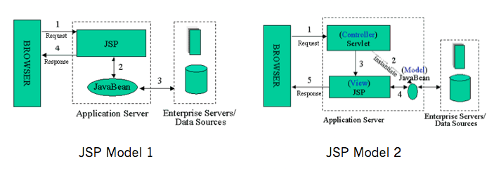

# 前言
1. 做客户端开发、前端开发对**MVC、MVP、MVVM**这些名饲不了解，但也应该大致听过，**它们都是为了解决图形界面应用程序复杂性管理问题而产生的应用架构模式**；
2. 网上很多文章关于这方面的讨论比较杂乱，各种MV模式之间的区别分不清，甚至有些描述都是错误的;
3. 本文追根溯源，从最经典的Smalltalk-80 MVC模式开始逐步还原图形界面之下最真实的MV模式;

# GUI程序所面临的问题
1. 图形界面的应用程序提供给用户可视化的操作界面，这个界面提供给数据和信息，其流程为：
    * 用户输入行为（键盘、鼠标等）会执行一些应用逻辑；
    * 应用逻辑（application logic）可能会触发一定的业务逻辑；
    * 业务逻辑（business logic）对应用程序数据的变更；
    * 数据的变更自然需要用户界面同步变更，以提供最准确的信息；

    例如：用户重新排序表格时，应用程序需要响应用户操作，对数据进行排序，然后需要同步到界面上；
2. 在开发应用程序的时候，以求更好的管理应用程序的复杂性，基于**职责分离-Speration of Duties**的思想都会对应用程序进行分层：
    * View层：在开发图形界面应用程序的时候，会把管理用户界面的层次称为View；
    * Model层：Model提供数据操作的接口，执行相应的业务逻辑，即界面数据的来源；
    
    

        
    

3. **有了View、Model的分层，那么问题就来了：View如何同步Model的变更？View和Model之间如何粘合在一起？**；
    * 带着这些问题开始探索MV模式，会发现这些模式之间的差异可以归纳为对这个问题处理的方式的不同，而**几乎所有的MV模式都是经典的Smalltalk-80 MVC的修改版**；

# Smalltalk-80 MVC
## 历史背景
1. 早在上个世纪70年代，美国的施乐公司（Xerox)的工程师研发了Smalltalk编程语言，并且开始用它编写图形界面的应用程序；
2. 在Smalltalk-80这个版本的时候，一位叫Trygve Reenskaug的工程师设计了MVC图形应用程序的架构模式，极大地降低了图形应用程序的管理难度；
3. 在四人帮（GoF）的设计模式当中并没有把MVC当做是设计模式，而仅仅是把它看成解决问题的一些类的集合；
4. Smalltalk-80 MVC和GoF描述的MVC是最经典的MVC模式；
## MVC的依赖关系
1. MVC把应用程序分成View、Model、Controller层；
2. Controller层：其职责是处理Model、View之间协作的应用逻辑，如：路由、输入预处理等﹔
3. Model层：其职责是存储数据，及处理业务逻辑；
4. Model、View、Controller三个层次的依赖关系如下：

    

       
    

    * Controller、View都依赖Model层；
    * Controller、 View可以互相依赖；  
        但是有些网上的资料Controller、View的依赖关系可能不一样，有些是单向依赖，有些是双向依赖；  
        这个其实关系不大，因为后面会看到它们的依赖关系都是为了**把处理用户行为触发的事件处理权交给controller**；
## MVC的调用关系
1. 用户对View操作以后，View捕获到这个操作，会把处理的权利交移给Controller（Pass calls）；
2. Controller会对来自View数据进行预处理、决定调用哪个Model的接口；
3. 然后由Model执行相关的业务逻辑；
4. 当Model变更了以后，会通过观察者模式（Observer Pattern）通知View；
5. View通过观察者模式收到Model变更的消息以后，会向Model请求最新的数据，然后重新更新界面；

    

上述流程看似没有什么特别的地方，但有几个需要特别关注的关键点：
1. **View是把控制权交移给controller，由controller执行应用程序相关的应用逻辑**（对来自View数据进行预处理、决定调用哪个Model的接口等等）；
2. **Controller操作Model，Model执行业务逻辑对数据进行处理**，但Model不会直接操作View，可以说它是对View无知的；
3. **View、Model的同步消息是通过观察者模式进行，而同步操作是由View自己请求Model的数据然后对视图进行更新**；

需要特别注意的是**MVC模式的精髓**在于第三点：**Model的更新是通过现察者模式告知View的，具体表现形式可以是Pub/Sub或者是触发Events**，网上很多对于MVC的描述都没有强调这一点；

通过**观察者模式的好处**是：
* 不同的MVC三角关系可能会有共同的Model，一个MVC三角中的Controller操作了Model以后，其他MVC三角的View都会接受到通知，然后更新自己；
* **保持了依赖同一块Model的不同View显示数据的实时性和准确性**；

我们每天都在用的观察者模式，在几十年前就已经被大神们整合到MVC的架构当中；
经典的Smalltalk-80 MVC不需要任何框架支持就可以实现，目前Web前端框架当中只有一个号称是严格遵循Smalltalk-80 MVC模式的: maria.js；

## MVC的优缺点
1. 优点：
    * **把业务逻辑和展示逻辑分离，模块化程度高**，且当应用逻辑需要变更的时候，不需要变更业务逻辑和展示逻辑，只需要Controller换成另外一个Controller就行了（Swappable Controller）；
    * **观察者模式可以做到多视图同时更新**；
2. 缺点：
    * **Controller测试困难**：因为视图同步操作是由View自己执行，而View只能在有UI的环境下运行；  
    在没有UI环境下对Controller进行单元测试的时候，应用逻辑正确性是无法验证的：Model更新的时候，无法对View的更新操作进行断言；
    * **View无法组件化**：View是强依赖特定的Model的，如果需要把这个View抽出来作为一个另外一个应用程序可复用的组件就困难了，因为不同程序的的Domain Model是不一样的；

## MVC总结：
1. Model层：负责存储应用程序的数据，执行相应的业务逻辑；
2. View层：负责将应用程序的数据展示到页面上;
3. Controller层：负责执行应用程序相关的应用逻辑，如：对来自View数据进行预处理、决定调用哪个Nodel的接口等；

# MVC Model 2
1. 在Web服务端开发的时候也会接触到MVC模式，而这种MVC模式不能严格称为MVC模式；
2. **经典的MVC模式只是解决客户端图形界面应用程序的问题，而对服务端无效**；
3. **服务端的MVC模式有自己特定的名字：MVC Model 2**，或者叫JSP Model 2，或者直接就是Model 2 ；

Model 2客户端服务端的交互模式如下：
1. 服务端接收到来自客户端的请求；
2. 服务端通过路由规则把这个请求交由给特定的Controller进行处理；
3. Controller执行相应的应用逻辑，对Model进行操作；
4. Model执行业务逻辑；
5. 用数据去渲染特定的模版，返回给客户端；

    

> 注：由于HTTP协议是单工协议并且是无状态的，所以**服务器无法直接给客户端推送数据**；  
> 除非客户端再次发起请求，否则服务器端的Model的变更就无法告知客户端；  
> 所以可以看到**经典的Smalltalk-80 MVC中Model通过观察者模式告知View更新这一环被无情地打破**；  
> 因此MVC Model 2不能称为严格的MVC；

Model 2模式最早在1998年应用在JSP应用程序当中，JSP Model 1应用管理的混乱诱发了JSP参考了客户端MVC模式，催生了Model 2：

    

后来**这种模式几乎被应用在所有语言的Web开发框架当中**，如：PHP的ThinkPHP，Python的Dijango、Flask，NodeJS的Express，Ruby的RoR，基本都采纳了这种模式，**平常所讲的MVC基本是这种服务端的MVC**；

# MVP

