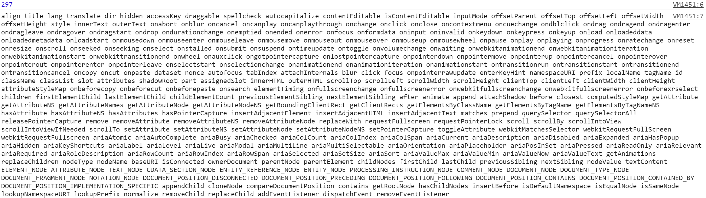

# 前端应用状态管理方式的演进：
例：写一个表格组件，并支持排序：
* 看起来很简单，只需要sortKey、sortType、data三个字段来存储排序状态和数据；
* 用户点击表头进行排序时，由js对数据进行排序，然后使用js/jquery操作DOMN对表格进行更新；
* 这样做的后果是，**随着应用程序越来越复杂，需要在js里面维护的字段、监听的事件也越来越多，应用程序会变得难以维护**；

所以人们就提出了下面几种方式来解决“**维护状态，更新视图**”的问题:
1. 后来人们使用了**MVC、MVP的架构模式**，希望能从代码组织方式来降低维护这种复杂应用程序的难度；
    **但是MVC架构没办法减少你所维护的状态，也没有降低状态更新时你对页面的DOM操作**；
    即需要操作的DOM还是需要操作，只是换了个地方而已；
2. **既然状态改变了就要操作相应的DOM元素，那为什么不做一个东西可以让视图和状态进行绑定呢？**，状态变更了视图自动变更，就不用手动更新页面了；
    这就是后来人们想出了**MVVM摸式**，只要在模版中声明视图组件是和什么状态进行绑定的，**双向绑定引擎会在状态更新的时候自动更新视图**；
    **MVVM模式可以很好的降低我们维护“状态->视图”的复杂程度（大大减少代码中的视图更新逻辑）**;
3. 但**MVVM并不是唯一的办法**，还有一个非常直观的方法，可以大大降低视图更新的操作：**一旦状态发生变化，就用模版引擎重新煊染整个视图，然后用新视图更换掉旧视图**；
    * 如例，当用户点击进行排序时，还是在JS里面更新状态，但页面更新就不用手动操作DOM了，而是直接把整个表格用模版引擎重新渲染一遍，然后用innerHTML更新视图即可；
    * 这样的做法，最大的问题就是会很慢，因为**一个小状态变更都要重新构造整棵DOM，性价比太低**﹔而且这样散的话，**input和textrea的会失去原有的焦点**；
    * 结论:
        * 对于局部小视图的更新，没有问题（ Backbone就是这么干的）;
        * 对于大型视图，如：全局应用状态变更，需要更新页面较多局部视图时，这样的做法不可取；
    * **但要知道这种做法，因为后面会发现，其实Virtual DOM就是这么做的，只是加了一些特别的步骤来避免了整棵DOM树变更**

> 注意：上面提供的几种方法，其实都在解决同一个问题：**维护状态，更新视图**，在一般应用中，如果能有很好方案来应对这个问题，那么就几乎降低了大部分复杂性；

# Virtual DOM算法原理
1. 首先要知道DOM操作是很慢的，如下是一个div元素的所有属性:
    ```js
    var div = document.createElement('div');
    var str  = [];
    for(var key in div) {
        str.push(key);
    }
    console.log(str.length);
    console.log(str.join(' '));
    ```
    <div align="left">
       
    </div>
    * 而这仅仅是第一层，**真正的DOM元素非常庞大的**，标准就是这么设计的；
    * 而且操作它们的时候你要小心翼翼，轻微的触碰可能就会导致页面重排，这可是杀死性能的罪魁祸首；
2. **相对于DOM对象，原生的JavaScript对象处理起来更快，而且更简单**；
    > DOM树上的结构、属性信息我们都可以很容易地用JavaScript对象表示出来：
    ```js
        var element = {
            tagName: "ul", // 节点标签名
            props: { // DOM的属性，用一个对象存储键值对
                id: "list"
            },
            children:[ // 该节点的子节点
                {tagName: 'li', props: {class: 'item'}, children: ["Item 1"]},
                {tagName: 'li', props: {class: 'item'}, children: ["Item 2"]},
                {tagName: 'li', props: {class: 'item'}, children: ["Item 3"]},
            ]
        };
    ```
    上面对应的HTML写法是：
    ```html
    <ul id="list">
        <li class="item">Item 1</li>
        <li class="item">Item 2</li>
        <li class="item">Item 3</li>
    </ul>
    ```
3. 既然原来DOM树的信息都可以用JavaScript对象来表示，反过来，就**可以用JavaScript对象表示的树结构来构建一棵真正的DOM树**；
    * **第一个章节所说的，“状态变更->重新渲染整个视图”的方式**可以稍微修改一下：
        > **用JavaScript对象表示DOM信息和结构，当状态变更的时候，重新渲染这个JavaScript的对象结构**；
    * 当然这样做其实没什么用，因为真正的页面并没有改变；
4. **但可以用“新渲染的对象树”和“旧的树”进行对比，记录这两棵树的差异，其不同的部分就是需要对页面真正的DOM操作，然后把它们应用在真正的DOM树上**，页面就变更了；
    这样就可以做到：视图的结构确实是整个全新渲染了，但是**最后操作DOM的时候确实只变更了不同的地方**；
5. 这就是所谓的Virtual DOM算法，包括几个步骤:
    * 用JavaScript对象结构表示DOM树的结构，然后用这个树构建一个真正的DOM树，插到文档中；
    * 当状态变更的时候，重新构造一棵新的对象树，然后用“新的树”和“旧的树”进行比较，记录两棵树的差；
    * 把步骤2记录的差异应用到步骤1所构建的真正的DOM树上，视图就更新了﹔
6. **Virtual DOM本质上就是在JS和DOM之间做了一个缓存**；
    * 可以类比CPU和硬盘，既然硬盘这么慢，我们就在它们之间加个缓存；
    * 既然DOM这么慢，我们就在JS和DOM之间加个缓存；
    * CPU（JS）只操作内存（Virtual DOM），最后的时候再把变更写入硬盘（DOM）；

# key的作用
1. 新旧Virtual DOM树进行Diff算法的时候，处于同一层节点的tagName是可以重复的（如：有两个\<div>标签），所以同一层节点不能使用tagName进行Diff比较；
2. 同一层节点需要加上唯一标识key，即可使用key进行Diff比较，这样才有可能复用老的DOM节点；
3. 同一层节点的key必须是唯一标识，不同层节点的key是可以重的；
4. 当同一层节点是列表时，最好不要用列表的索引作为key，因为当前面某项被删除时，后面项索引的变化会导致key发生变化，从而key就失效了；

[查看原文：如何实现一个 Virtual DOM 算法](https://github.com/livoras/blog/issues/13)