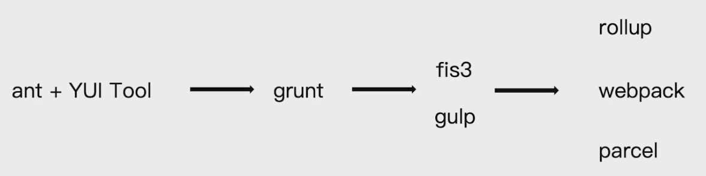
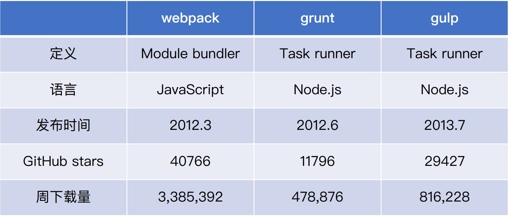
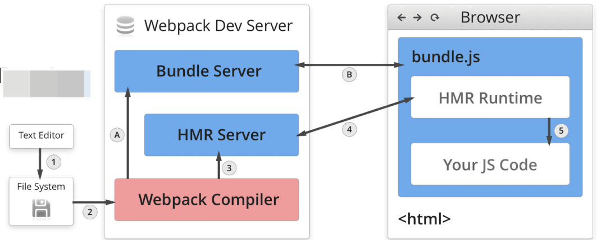

# 目录
1. [前端构建演变之路](#build-evolution-process)
1. [为什么选择webpack](#why-select-webpack)
1. [初识webpack](#know-webpack)
1. [环境搭建：安装webpack](#building-webpack-environment)
1. [webpack执行过程：](#webpack-exec-process)
1. [webpack初体验：⼀个最简单的例⼦](#hello-webpack)
1. [webpack核心概念之entry](#webpack-entry)
1. [webpack核心概念之output](#webpack-output)
1. [webpack核心概念之loaders](#webpack-loaders)
1. [webpack核心概念之plugins](#webpack-plugins)
1. [webpack核心概念之mode](#webpack-mode)
1. [解析ES6、React JSX](#webpack-es6-react-jsx)
1. [解析CSS、Less、Sass](#webpack-css-less-sass)
1. [解析图片和字体](#webpack-img-font)
1. [webpack中的文件监听](#webpack-watch)
1. [webpack中的热更新及原理分析](#webpack-hmr)
1. [文件指纹策略：hash、chunkhash、contenthash](#webpack-filename-hash)
1. [HTML、CSS、JavaScript代码压缩](#webpack-js-css-html-compress)
1. [自动清理构建目录产物](#webpack-clean)

# <span id="build-evolution-process">前端构建演变之路</span>
<div align="left">
    
</div>

# <span id="why-select-webpack">为什么选择webpack</span>
<div align="left">
    
</div>

# <span id="know-webpack">初识webpack</span>
1. 配置⽂件名称：
    * webpack默认配置⽂件：webpack.config.js
    * webpack默认配置⽂件：webpack.config.js
2. webpack配置组成：
    ```js
    module.exports = {
        entry: './src/index.js', // 打包的⼊⼝⽂件
        output: './dist/main.js', // 打包的输出
        mode: 'production', // 环境
        module: {
            rules: [ // Loader配置
                { test: /\.txt$/, use: 'raw-loader' }
            ]
        },
        plugins: [ // 插件配置
            new HtmlWebpackPlugin({
                template: './src/index.html'
            })
        ]
    };
    ```

# <span id="building-webpack-environment">环境搭建：安装webpack</span>
1. 安装Node.js和NPM：
    * 安装nvm（https://github.com/nvm-sh/nvm）
        * 通过curl安装：curl -o- https://raw.githubusercontent.com/nvm-sh/nvm/v0.34.0/install.sh | bash
        * 通过wget安装：wget -qO- https://raw.githubusercontent.com/nvm-sh/nvm/v0.34.0/install.sh | bash
    * 安装Node.js和NPM
        * nvm install v10.15.3
        * 检查是否安装成功：node -v, npm -v
2. 环境搭建：安装webpack和webpack-cli
    * 创建空⽬录和package.json
        * `mkdir my-project`
        * `cd my-project`
        * `npm init -y`
    * 安装webpack和webpack-cli
        * `npm install webpack webpack-cli --save-dev`
        * 检查是否安装成功：`./node_modules/.bin/webpack -v`

# <span id="webpack-exec-process">webpack执行过程：</span>
1. 安装webpack后，会在node_modules/.bin目录下生成一个webpack、webpack.cmd；
    * **webpack是linux下的命令脚本**；
    * **webpack.cmd是windows下命令脚本**；
2. 在window环境下，执行webpack时，会选择webpack.cmd执行：
    * **webpack.cmd会判断当前目录是否存在node执行程序，若存在则使用当前node进程执行`node_modules/webpack/bin/webpack.js`**；
    * **如果当前目录不存在node进程，则使用全局（也就是本地）node执行`node_modules/webpack/bin/webpack.js`**；
3. **`node_modules/webpack/bin/webpack.js`会判断是否安装了webpack-cli模块**：
    * 若没安装webpack-cli模块，就会引导用户去安装；
    * 若已安装webpack-cli模块，就会去执行`node_modules/webpack-cli/bin/cli.js`；
4. * `node_modules/webpack-cli/bin/cli.js`中会`require("webpack")`，引入webpack模块（`/node_modules/lib/webpack.js`）得到一个webpack函数；
    * 运行webpack函数，返回一个compiler对象，执行compiler中的run，开始编译；

# <span id="hello-webpack">webpack初体验：⼀个最简单的例⼦</span>
1. 创建webpack.config.js
    ```js
    'use strict'
    const path = require('path');

    module.exports = {
        entry: './src/index.js',
        output: {
            path: path.join(__dirname, 'dist'), // 指定打包生成的目录
            filename: 'bundle.js' // 指定打包生成的文件名
        },
        mode: 'production' // 设置为生产环境
    }
    ```
2. 创建./src/index.js、./src/helloworld.js文件
    ```js
    // helloworld.js
    export function helloworld() {
        return 'hello webpack';
    }

    // index.js
    import { helloworld } from './helloworld';

    document.write(helloworld());
    ```
3. 在package.json中添加build命令：
    * `"build": "./node_modules/.bin/webpack --config webpack.config.js"`
4. 执行`npm run build`
5. 在页面上验证效果
    * 在dist目录中手动创建index.html文件
    * 在index.html文件中引入打包好的bundle.js
    * 在浏览器中打开index.html

# <span id="webpack-entry">webpack核心概念之entry</span>
1. **entry⽤来指定webpack的打包⼊⼝**；
2. 单⼊⼝：entry是⼀个字符串；
    ```js
    module.exports = {
        entry: './src/app.js'
    };
    ```
3. 多⼊⼝：entry是⼀个对象；
    适合多页面场景；
    ```js
    module.exports = {
        entry: {
            app: './src/app.js',
            adminApp: './src/adminApp.js'
        }
    };
    ```

# <span id="webpack-output">webpack核心概念之output</span>
1. **Output⽤来告诉webpack如何将编译后的⽂件输出到磁盘**；
2. 单⼊⼝配置：
    ```js
    module.exports = {
        entry: './path/to/my/entry/file.js'
        output: {
            filename: 'bundle.js',
            path: __dirname + '/dist'
        }
    };
    ```
3. 多⼊⼝配置:
    ```js
    module.exports = {
        entry: {
            app: './src/app.js',
            search: './src/search.js'
        },
        output: {
            filename: '[name].js', // 通过占位符确保⽂件名称的唯⼀
            path: __dirname + '/dist'
        }
    };
    ```

# <span id="webpack-loaders">webpack核心概念之loaders</span>
1. **webpack开箱即用只支持JS和JSON两种文件类型**;
    * **通过Loaders去支持其它文件类型并且把它们转化成有效的模块，并且可以添加到依赖图中**;
    * 本身是一个函数，接受源文件作为参数，返回转换的结果；
2. 常见的Loaders：
    名称|描述
    |:-|:-|
    babel-loader|转换ES6、ES7等JS新特性语法
    css-loader|支持.css文件的加载和解析
    less-loader|将less文件转换成css
    ts-loader|将TS转换成JS
    file-loader|进行图片、字体等的打包
    raw-loader|将文件以字符串的形式导入
    thread-loader|多进程打包JS和CSS
3. Loaders的用法：
    ```js
    const path = require('path');
    module.exports = {
        output: {
            filename: 'bundle.js'
        },
        module: {
            rules: [
                {
                    test: /\.txt$/, // test指定匹配规则
                    use: 'raw-loader' // use指定使⽤的loader名称
                }
            ]
        }
    };
    ```

# <span id="webpack-plugins">webpack核心概念之plugins</span>
1. **plugins⽤于bundle⽂件的优化，资源管理和环境变量注⼊**；
    * 即任何Loaders无法做的事情，都可以通过plugins来完成：
        * 如：打包之前，删除dist目录可以通过plugins来完成；
    * plugins作⽤于整个构建过程，即构建开始到结束的过程，都是可以使用plugins的；
2. 常见的Plugins：
    名称|描述
    |:-|:-|
    CommonsChunkPlugin|将chunks相同的模块代码提取成公共js；<br />通常用在多页面的情况下，可以把每个页面公共的js提取处理，放到一个common.js文件中；
    CleanWebpackPlugin|清理构建目录
    ExtractTextWebpackPlugin|将CSS从bunlde文件里提取成一个独立的CSS文件
    CopyWebpackPlugin|将文件或者文件夹拷贝到构建的输出目录
    HtmlWebpackPlugin|创建html文件去承载输出的bundle
    UglfyjsWebpackPlugin|压缩JS
    ZipWebpackPlugin|将打包出的资源生成一个zip包
3. Plugins的⽤法：
    ```js
    const path = require('path');
    module.exports = {
        output: {
            filename: 'bundle.js'
        },
        plugins: [
            new HtmlWebpackPlugin({template: './src/index.html'})
        ]
    };
    ```

# <span id="webpack-mode">webpack核心概念之mode</span>
1. **mode⽤来指定当前的构建环境是：production、development、none**；
    * webpack4才提出的API；
    * 设置mode可以使⽤webpack内置的函数，默认值为production；
2. mode的内置函数功能
    选项|描述
    |:-|:-|
    development|设置process.env.NODE_ENV的值为development；<br />开启NamedChunksPlugin、NamedModulesPlugin（这两个插件是在代码热更新阶段（即hmr阶段）很有用，可以在控制台打印出是哪个模块发生了热更新，及这个模块的路径等）；
    production|设置process.env.NODE_ENV的值为production；<br />开启FlagDependencyUsagePlugin、FlagIncludedChunksPlugin、ModuleConcatenationPlugin、NoEmitOnErrorsPlugin、OccurrenceOrderPlugin、SideEffectsFlagPlugin、TerserPlugin；
    none|不开启任何优化选项；

# <span id="webpack-es6-react-jsx">解析ES6、TypeScript、React JSX</span>
1. 解析ES6
    * `npm i @babel/core @babel/preset-env babel-loader -D`
    * babel的配置⽂件是：.babelrc；
        * 在.babelrc文件中增加ES6的babel preset配置，使用@babel/preset-env
            ```json
            {
                "presets": [ // 一系列babel plugins的集合
                    "@babel/preset-env" // ES6的babel preset配置
                ],
                "plugins": [ // 一个plugin对应一个功能
                    "@babel/proposal-class-properties"
                ]
            }
            ```
    * webpack中使⽤babel-loader
        ```js
        const path = require('path');
        module.exports = {
            entry: './src/index.js',
            output: {
                filename: 'bundle.js',
                path: path.resolve(__dirname, 'dist')
            },
            module: {
                rules: [
                    {
                        test: /\.js$/,
                        use: 'babel-loader'
                    }
                ]
            }
        };
        ```
        * 在webpack.config.js中配置babel：
            ```js
            const path = require('path');
            module.exports = {
                entry: './src/index.js',
                output: {
                    filename: 'bundle.js',
                    path: path.resolve(__dirname, 'dist')
                },
                module: {
                    rules: [
                        {
                            test: /\.js$/,
                            use: [
                                loader: 'babel-loader',
                                options: { // 配置babel
                                    presets: ["@babel/preset-env"]
                                }
                            ]
                        }
                    ]
                }
            };
            ```
            * 注：**虽然在webpack.config.js中也可以配置babel，但是当babel-loader下的options配置比较复杂，最好在.babelrc文件中配置**；
    * Babel介绍
        * **Babel是一个JavaScript编译器；即把浏览器不认识的语法，编译成浏览器认识的语法**；
        * Babel可以解析JavaScript新标准的方法，编译成兼容绝大多数的主流浏览器的代码；
        * 在Babel6.x版本之后，所有的插件都是可插拔的，即**安装了Babel之后，还需要配置对应的.babelrc文件，Babel才能工作**；
        * presets、plugins属性：
            * **presets**：**即plugins的组合（套餐）**；
                * 为了支持es6+编译，需引入很多plugin及配置，很麻烦；
                * 这时就可以在presets中引入@babel/preset-env，@babel/preset-env中会自动引入所有es6+编译需要的plugins；
                * 当然还有一些功能是不支持presets的，这时就需要手动引入plugin；
            * plugins：告诉babel要使用那些插件，这些插件可以控制如何转换代码；
            * plugins、presets编译顺序：
                * **plugins优先于presets进行编译**；
                * **plugins按照数组的index增序(从数组第一个到最后一个)进行编译**；
                *** presets按照数组的index倒序(从数组最后一个到第一个)进行编译**；
        * 常用的Babel有：
            名称|描述
            |:-|:-|
            @babel/cli|Babel附带了一个内置的CLI，可用于从命令行编译文件；
            @babel/core|使用本地配置文件；
            @babel/preset-env|编译最新版本JavaScript；
            @babel/preset-react|编译react；
            @babel/polyfill|通过Polyfill方式在目标环境中添加缺失的特性；
            @babel/plugin-proposal-class-properties|编译class；
2. 解析TypeScript
    * `npm install typescript ts-loader -D`
    * 创建tsconfig.json文件及配置：
        * `tsc --init`生成tsconfig.js文件；
        * 根据需求修改对应的配置，如：
            * outDir：当使用loader打包tsx文件时，打包文件会放在这个配置项配置的目录下；
            * module：指的是我们使用的是ES module的方式引入；
            * target：这个指的是我们最终打包的时候，需要把typescript转化为什么样的形式。写es5可以打包成es5的语法,在大部分浏览器上都可以运行；
            * allowJs：表示可以在ts的语法中引入js这样的模块或文件；
    * 在webpack配置文件中配置：
        ```js
        module:{
            rules:[
                {
                    test:/\.tsx$/,
                    use:'ts-loader',
                    exclude: /node_modules/ // 表示node_modules中的tsx文件不做处理
                }
            ]
        }
        ```
3. 解析React JSX
    * `npm i react react-dom @babel/preset-react -D`
    * 在.babelrc文件中增加React JSX的babel preset配置
    ```json
    {
        "presets": [
            "@babel/preset-env", // ES6的babel preset配置
            "@babel/preset-react" // React的babel preset配置
        ],
        "plugins": [
            "@babel/proposal-class-properties"
        ]
    }
    ```
    * 测试：
        * 创建一个React组件，然后执行`npm run build`打包：
            ```js
            import React from 'react';
            import ReactDOM from 'react-dom';

            class Search extends React.Component {
                render() {
                    return <div>Search Text</div>;
                }
            }

            ReactDOM.render(
                <Search />,
                document.getElementById('root')
            );
            ```
        * 在dist目录创建一个search.html文件，引入打包好的search.js，并打开页面看效果：
            ```html
            <!DOCTYPE html>
            <html lang="en">
            <head>
                <meta charset="UTF-8">
                <meta http-equiv="X-UA-Compatible" content="IE=edge">
                <meta name="viewport" content="width=device-width, initial-scale=1.0">
                <title>Document</title>
            </head>
            <body>
                <div id="root"></div>
                <script src="./search.js" type="text/javascript"></script>
            </body>
            </html>
            ```
    * 为什么react和react-dom要分成两个包？
        * React在v0.14之前是没有react-dom的，所有功能都包含在react里；
        * 从v0.14(2015-10)开始，react才被拆分成react和react-dom；
        * 为什么要把react和react-dom分开呢？因为有了react-native；
        * **react只包含了Web和Mobile通用的核心部分**；
        * **负责Dom操作的分到react-dom中**；
        * **负责Mobile的包含在react-native中**；
        * 即**React不仅能用在Web页面，还能用在服务器端SSR，移动端和桌面端，而ReactDOM只负责和Web页面的DOM打交道**；
        ```js
        // Web端React代码
        import React from 'react';
        import ReactDOM from 'react-dom';
        const App = () => (
            <div>
                <h1>Hello React</h1>
            </div>
        );
        ReactDom.render(<App/>, document.getElementById('root'));

        // 移动端的ReactNative代码
        import React from 'react';
        import {Text, View} from 'react-native';
        const WelcomeScreen = () => (
            <View>
                <Text>Hello ReactNative</Text>
            </View>
        );

        // Web端、移动端都需要import React from 'react';
        // 而Web应用需要import ReactDOM from 'react-dom';
        // Mobile应用需要import {Text, View} from 'react-native';
        ```

# <span id="webpack-css-less-sass">解析CSS、Less、Sass</span>
1. **css-loader⽤于加载.css⽂件，并且转换成commonjs对象**；
    * **style-loader将样式通过\<style>标签插⼊到head中**；
    * `npm i style-loader css-loader -D`
    ```js
    const path = require('path');
    module.exports = {
        entry: './src/index.js',
        output: {
            filename: 'bundle.js',
            path: path.resolve(__dirname, 'dist')
        },
        module: {
            rules: [
                {
                    test: /\.css$/,
                    use: [ // 这里webpack使用的是链式调用，从右到左的，即需要先调用的css-loader写在最后
                        'style-loader', // 将样式通过\<style>标签插⼊到head中
                        'css-loader' // ⽤于加载.css⽂件，并且转换成commonjs对象
                    ]
                }
            ]
        }
    };
    ```
    * 测试：
        * 创建search.css文件：
            ```css
            .search-text {
                font-size: 20px;
                color: red;
            }
            ```
        * 在search.js中引入search.css：
            ```js
            import React from 'react';
            import ReactDOM from 'react-dom';
            import './search.css';
            class Search extends React.Component {
                render() {
                    return <div className="search-text">Search Text</div>;
                }
            }
            ReactDOM.render(
                <Search />,
                document.getElementById('root')
            );
            ```
        * 在webpacke.config.js中配置style-loader、css-loader；
2. **less-loader⽤于将less转换成css**
    * `npm i less less-loader -D`，因为less-loader是依赖于less的，所以less也要安装
    * 测试：
        * 把search.css改成search.less；
        * 在search.js中引入search.less；
        * 在webpacke.config.js中增加对less的解析：
            ```js
            module: {
                rules: [
                    {
                        test: /\.js$/,
                        use: 'babel-loader'
                    },
                    {
                        test: /\.css$/,
                        use: [
                            'style-loader',
                            'css-loader'
                        ]
                    },
                    {
                        test: /\.less$/, // 增加对less的解析
                        use: [
                            'style-loader',
                            'css-loader',
                            'less-loader'
                        ]
                    }
                ]
            }
            ```
3. **sass-loader用于将scss转换成css**
    * `npm i node-sass sass-loader -D`
        * sass-loader内部依赖于node-sass；
        * 若按照node-sass失败，则执行下面命令后重试：
            * `npm config set sass_binary_site https://npm.taobao.org/mirrors/node-sass/`
    * 在webpack中配置sass-loader：
        ```js
        {
            test: /\.scss$/,
            use: [
                'style-loader',
                'css-loader',
                'sass-loader'
            ]
        }
        ```
# <span id="webpack-img-font">解析图片和字体</span>
1. **file-loader⽤于处理图片**；
    * `npm i file-loader -D`
    ```js
    const path = require('path');
    module.exports = {
        entry: './src/index.js',
        output: {
            filename: 'bundle.js',
            path: path.resolve(__dirname, 'dist')
        },
        module: {
            rules: [
                {
                    test: /\.(png|svg|jpg|gif)$/,
                    use: [
                        'file-loader'
                    ]
                }
            ]
        }
    };
    ```
    * 测试：
        * 增加图片./assets/images/avatar.png
        * 在search.js中引入图片：
            ```js
            import React from 'react';
            import ReactDOM from 'react-dom';
            import avatar from './assets/images/avatar.png'; // 引入图片
            import './search.less';
            class Search extends React.Component {
                render() {
                    return <div className="search-text">
                        Search Text 
                    </div>;
                }
            }
            ReactDOM.render(
                <Search />,
                document.getElementById('root')
            );
            ```
        * 在webpacke.config.js中增加对图片的解析：
            ```js
            module: {
                rules: [
                    {
                        test: /\.(png|svg|jpg|gif)$/,
                        use: [
                            'file-loader'
                        ]
                    }
                ]
            }
            ```
2. **file-loader⽤于处理字体**
    * `npm i file-loader -D`
    ```js
    const path = require('path');
    module.exports = {
        entry: './src/index.js',
        output: {
            filename: 'bundle.js',
            path: path.resolve(__dirname, 'dist')
        },
        module: {
            rules: [
                {
                    test: /\.(woff|woff2|eot|ttf|otf)$/,
                    use: [
                        'file-loader'
                    ]
                }
            ]
        }
    };
    ```
    * 测试：
        * 增加字体./assets/font/SourceHanSerifSC-Heavy.otf
        * 在search.less文件中使用该字体：
            ```less
            @font-face {
                font-family: 'SourceHanSerifSC-Heavy';
                src: url('./assets/font/SourceHanSerifSC-Heavy.otf') format('truetype');
            }

            .search-text {
                font-size: 20px;
                color: red;
                font-family: 'SourceHanSerifSC-Heavy'
            }
            ```
        * 在webpacke.config.js中增加对字体的解析：
            ```js
            module: {
                rules: [
                    {
                        test: /\.(woff|woff2|eot|ttf|otf)$/,
                        use: [
                            'file-loader'
                        ]
                    }
                ]
            }
            ```
3. **url-loader也可以处理图⽚和字体**
    * 其实url-loader和file-loader差不多，只是url-loader可以设置较⼩资源⾃动base64；
    * url-loader内部其实是用到file-loader的；
    * limit的单位是字节，如果文件小于limit的值，那么webpack会自动对文件进行base64；
    * `npm i url-loader -D`
    ```js
    const path = require('path');
    module.exports = {
        entry: './src/index.js',
        output: {
            filename: 'bundle.js',
            path: path.resolve(__dirname, 'dist')
        },
        module: {
            rules: [
                {
                    test: /\.(png|svg|jpg|gif)$/,
                    use: [
                        {
                            loader: 'url-loader', 
                            options: { 
                                limit: 10240 // 10k
                            }
                        }
                    ] 
                }
            ]
        }
    };
    ```
    * 测试：
        * 首先把上述在webpack.config.js配置的file-loader替换成url-loader：
            ```js
            module: {
                rules: [
                    {
                        test: /\.(png|svg|jpg|gif)$/,
                        use: [
                            {
                                loader: 'url-loader', 
                                options: { 
                                    limit: 10240 // 10k
                                }
                            }
                        ] 
                    }
                ]
            }
            ```
        * 执行`npm run build`后，图片会自动base64，并放到search.js中，即dist目录不会单独有一个图片了；

# <span id="webpack-watch">webpack中的文件监听</span>
1. ⽂件监听：
    * **指在发现源码发⽣变化时，⾃动重新构建出新的输出⽂件**；
    * 主要解决每次修改源代码后，需要手动构建，很麻烦的问题；
2. webpack开启监听模式，有两种⽅式：
    * 启动webpack命令时，带上--watch参数，如：`webpack --watch`；
        * 在package.json中添加`build-watch`命令：
            ```js
             "scripts": {
                "test": "echo \"Error: no test specified\" && exit 1",
                "build": "./node_modules/.bin/webpack --config webpack.config.js",
                "build-watch": "./node_modules/.bin/webpack --config webpack.config.js --watch"
            },
            ```
        * **唯⼀缺陷：每次需要⼿动刷新浏览器**；
    * 在配置webpack.config.js中设置watch: true；
3. ⽂件监听的原理分析：
    * webpack会轮询判断⽂件的最后编辑时间是否变化；
    * 当某个⽂件发⽣变化时，并不会⽴刻告诉监听者，⽽是先缓存起来，等aggregateTimeout到后，在重新构建；
    * 在webpack.config.js中配置watch：
        ```js
        module.export = {
            watch: true, // 默认false，不开启
            watchOptions: { // 只有开启监听模式时，watchOptions才有效
                ignored: /node_modules/, // 默认为空，不监听的文件或者文件夹，支持正则匹配，可提升性能
                aggregateTimeout: 300, // 监听到变化发生后会等300ms再去执行，默认300ms
                poll: 1000 // 判断文件是否发生变化是通过不停询问系统指定文件有没有变化实现的，默认每秒问1000次
            }
        }
        ```

# <span id="webpack-hmr">webpack中的热更新及原理分析</span>
1. **热更新：使用webpack-dev-server**；
    * **即每次修改文件内容后，会自动构建，及更新页面**；
    * 特点：
        * **WDS不刷新浏览器**；
        * **WDS不输出⽂件，构建的内容放在内存中**（webpack中的watch是把构建的内容输出到文件中）；
    * **WDS需要和HotModuleReplacementPlugin插件(webpack内置的插件)一起使用，才能启动热更新功能**；
2. 实践：
    * 在package.json文件中添加`"serve": "webpack serve --config webpack.config.js"`命令；
    * webpack.config.js中的修改：
        ```js
        const path = require('path');
        const webpack = require('webpack');
        module.exports = {
            mode: 'development',
            plugins: [
                new webpack.HotModuleReplacementPlugin()
            ],
            devServer: {
                contentBase: path.join(__dirname, "dist"), // WDS服务的基础目录
                host: 'localhost', // 服务器的ip地址
                compress: true, // 服务器压缩
                port: 3000, // 端口
                open: true, // 自动打开页面
                hot: true // 开启热更新
            }
        }
        ```
    * 按照webpack-dev-server依赖：`npm install webpack-dev-server -D`
    * 执行`npm run serve`；
3. **热更新：使⽤webpack-dev-middleware**；
    * 热更新除了通过上述webpack-dev-server、HotModuleReplacementPlugin方式之外，还可以通过webpack-dev-middleware实现；
    * 该热更新方式，在日常的开发过程中使用比较多，因为它比较灵活；
    * **WDM将webpack输出的⽂件传输给服务器，适⽤于灵活的定制场景**，可以控制更多的webpack配置；
    * 例：
        ```js
        const express = require('express');
        const webpack = require('webpack');
        const webpackDevMiddleware = require('webpack-devmiddleware');
        const app = express();
        const config = require('./webpack.config.js');
        const compiler = webpack(config);
        app.use(
            webpackDevMiddleware(compiler, { publicPath: config.output.publicPath })
        );
        app.listen(3000, function () {
            console.log('Example app listening on port 3000!\n');
        });
    ```
4. 热更新的原理分析
    * HMR(Hot Module Replacement)；
    * **Webpack Compiler**：用于将js源代码编译成bundle.js(最后打包好输入的文件)；
    * **HMR Server**：用于将热更新的文件传输给HMR Runtime；
    * **Bundle Server**：用于提供文件在浏览器的访问，即以服务器的方式访问，如：localhost:8080/bundle.js；
    * **HMR Runtime**：
        * 在开发阶段，会将HMR Runtime注入到浏览器端的bundle.js里面；
        * 这时浏览器端的bundle.js就与服务器进行了连接，通常这个连接是一个websocket；
        * 当收到HMR Server发送的文件更新的内容后，会自动更新页面；
    <div align="left">
        
    </div>

    * **热更新的过程**：
        * 启动阶段：即图中的①->②->A->B路线；
            * Webpack Compiler将File System中的文件打包，然后把编译好的文件传输给Bundle Server；
            * Bundle Server其实就是一个服务器，这时浏览器就可以访问到打包的文件了；
        * 文件更新阶段：即图中的①->②->③->④路线；
            * File System中的文件发生变化后，通过Webpack Compiler进行编译；
            * Webpack Compiler将编译好的代码发送给HMR Server，HMR Server就可以知道那些模块发生了改变；
            * 然后HMR Server会通知HMR Runtime，通过JSON进行传输，然后HMR Runtime就会更新代码，不刷新浏览器；

# <span id="webpack-filename-hash">文件指纹策略：hash、chunkhash、contenthash</span>
1. 什么是⽂件指纹？
    * **打包后输出的⽂件名的后缀**；
2. 文件指纹的好处：
    * 用来做版本管理：即修改了的文件可以修改其文件指纹，没有修改的文件不用修改文件指纹；
    * 用来做浏览器缓存：对于没有修改的文件，浏览器还可以用缓存，可以加速页面的访问；
3. 常见的文件指纹：
    * **Hash**：**和整个项⽬的构建相关，只要项⽬⽂件有修改，整个项⽬构建的hash值就会更改**（构建后所有文件的hash值是一样的）**（项目级）**；
        * 缺点：**导致整个项目的文件缓存都将失效**；
    * **Chunkhash**：**和webpack打包的chunk（即Module）有关，不同的entry会⽣成不同的chunkhash值（模块级）**；
        * 弥补了Hash的缺点，即**没有内容变化的文件，项目构建时不会更改其文件的hash值**；
        * 缺点：某个js中import一个css文件，**当只有js/css内容发生变化时，如果使用chunkhash的话，js和该css的文件名hash都会发生变化**，没有达到缓存意义，固contenthash的用途随之而来；
    * **Contenthash**：**根据⽂件内容来定义hash，⽂件内容不变，则contenthash不变（文件级）**；
        * contenthash是针对文件内容级别的，只有你自己模块的内容变了，那么hash值才改变
    * 通常，**对于js文件使用chunkhash，对于css文件使用contenthash**；
4. 在webpack.config.js中配置文件指纹：
    * 由于文件指纹是在打包阶段使用的，而上面的webpack配置是针对开发阶段的，所以这里新键一个webpack.prod.js；
    * **js的文件指纹设置**：
        ```js
        module.exports = {
            entry: {
                app: './src/app.js',
                search: './src/search.js'
            },
            output: {
                filename: '[name]_[chunkhash:8].js', // js文件使用chunkhash
                path: __dirname + '/dist'
            }
        };
        ```
    * **css的文件指纹设置**：
        * 通过MiniCssExtractPlugin把css提取成一个独立的文件；
            * `npm i mini-css-extract-plugin -D`
            * 注：**mini-css-extract-plugin和style-loader是互斥的，不能一起使用**；
                * style-loader是把css插入到html head里面；
        ```js
        const MiniCssExtractPlugin = require('mini-css-extract-plugin');
        module: {
            rules: [
                {
                    test: /\.css$/,
                    use: [
                        // 'style-loader', // 不能使用style-loader，与MiniCssExtractPlugin.loader互斥
                        MiniCssExtractPlugin.loader, // 使用mini-css-extract-plugin的loader
                        'css-loader'
                    ]
                },
                {
                    test: /\.less$/,
                    use: [
                        MiniCssExtractPlugin.loader,
                        'css-loader',
                        'less-loader'
                    ]
                },
                {
                    test: /\.scss$/,
                    use: [
                        MiniCssExtractPlugin.loader,
                        'css-loader',
                        'sass-loader'
                    ]
                }
            ]
        },
        plugins: [
            new MiniCssExtractPlugin({
                filename: '[name]_[contenthash:8].css' // css文件使用contenthash
            });
        ]
        ```
    * **图⽚的⽂件指纹设置**：
        * 图片中的hash和js、css中的hash含义是不一样的：
            * 图片中的hash是文件内容的Hash，默认是md5生成；
            * [hash:8]表示取MD5的前8位，MD5默认有32位；
        ```js
        module: {
            rules: [
                {
                    test: /\.(png|svg|jpg|gif)$/,
                    use: [{
                        loader: 'file-loader',
                        options: {
                            name: 'img/[name]_[hash:8].[ext] '
                        }
                    }]
                }
            ]
        }
        ```
        * 占位符：
            占位符名称|含义
            |:-------|:--|
            [ext]|资源后缀名；
            [name]|文件名称；
            [path]|文件的相对路径；
            [folder]|文件所在的文件夹；
            [contenthash]|文件的内容hash，默认是md5生成；
            [hash]|文件内容的Hash，默认是md5生成；
            [emoji]|一个随机的指代文件内容的emoj；

# <span id="webpack-js-css-html-compress">HTML、CSS、JavaScript代码压缩</span>
1. JS压缩
    *  webpack4以后内置了`uglifyjs-webpack-plugin`；
    * 当然也可以下载`uglifyjs-webpack-plugin`，手动配置一些额外的参数，如：开启并行压缩：
        ```js
        new UglifyjsWebpackPlugin({
            parallel: true
        })
        ```
2. CSS压缩
    * 在webpack3中，可以设置`css-loader`的`minimize`参数来压缩css的：
        ```js
        {
            loader: 'css-loader', 
            options: {
                minimize: true // 设置css压缩
            }
        }
        ```
    * 但是在`css-loader1.0`以后，去掉了`minimize`参数，所以现在没法通过`css-loader`压缩css文件了；
    * 现在需要使用`optimize-css-assets-webpack-plugin`来压缩css，使用该插件前，还需要安装css预处理器`cssnano`：
        * `npm i cssnano optimize-css-assets-webpack-plugin -D`
        ```js
        module.exports = {
            entry: {
                app: './src/app.js',
                search: './src/search.js'
            },
            output: {
                filename: '[name][chunkhash:8].js',
                path: __dirname + '/dist'
            },
            plugins: [
                new OptimizeCSSAssetsPlugin({
                    assetNameRegExp: /\.css$/g, // 匹配所有的css文件
                    cssProcessor: require('cssnano') // 使用cssnano预处理器进行压缩，webpack5以后会报错，可不用cssProcessor参数
                })
            ]
        };
        ```
3. HTML压缩
    * `npm i html-webpack-plugin -D`；
    * 在webpack配置文件中引入：
        ```js
        module.exports = {
            entry: {
                app: './src/app.js',
                search: './src/search.js'
            },
            output: {
                filename: '[name][chunkhash:8].js',
                path: __dirname + '/dist'
            },
            plugins: [
                new HtmlWebpackPlugin({
                    template: path.join(__dirname, 'src/search.html'), // html模板所在的位置
                    filename: 'search.html', // 指定打包出来的文件名
                    chunks: ['search'], // 指定生成的html中要使用那些chunk
                    inject: true, // 为true时，会把打包出来chunk中的js、css注入到该html中
                    minify: { // 设置压缩参数
                        html5: true,
                        collapseWhitespace: true,
                        preserveLineBreaks: false,
                        minifyCSS: true,
                        minifyJS: true,
                        removeComments: false
                    }
                })
            ]
        };
        ```
    * **通常情况下，一个页面（html文件）对应一个HtmlWebpackPlugin，即多页面打包时需要定义多个HtmlWebpackPlugin**；

# <span id="webpack-clean">自动清理构建目录产物</span>
1. **每次构建的时候不会清理dist⽬录，造成构建的输出⽬录output⽂件越来越多，或需要手动删除**；
2. 方法1：通过npm scripts清理构建⽬录：
    * `rm -rf ./dist && webpack`
    * `rimraf ./dist && webpack`
    * 但是这种不太优雅；
3. 方法2：使用`clean-webpack-plugin`：
    * 默认会删除output指定的输出⽬录；
    * `npm i clean-webpack-plugin -D`
    * 在webpack配置文件中引入：
        ```js
        const { CleanWebpackPlugin } = require('clean-webpack-plugin'); // 新版本的clean-webpack-plugin引入方式
        module.exports = {
            plugins: [
                new CleanWebpackPlugin()
            ]
        };
        ```
    * 执行`npm run build`


[webpack官网](https://webpack.js.org/api/)