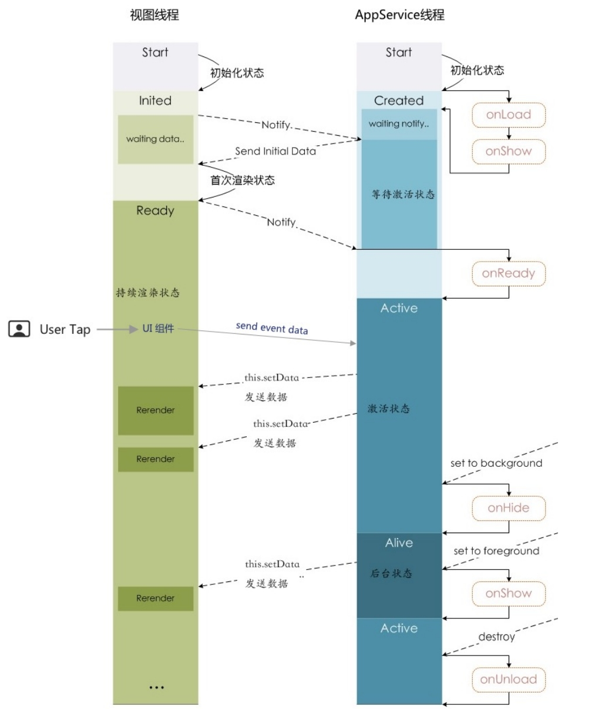

# 05 | 小程序运行机制简介：从零构建一个Web App需要做哪些事情？

## WXS语言
* **WXS是微信自已打造的编程语言**
* 既然**js是小程序的主要开发语言**了，用js就已经足够了，那么为什么微信还要自己发明一个WXS语言呢？而且WXS还不是很完善

## 启动机制
* 小程序启动会有两种情况：
    * 冷启动：指用户首次打开，或者小程序被微信主动摧毁之后再次打开，这时小程序需要重新加载并启动；
        * 小程序被主动销毁有两种情况：
            1. 当小程序进入后台，在后台维持运行超过一定的时间（目前大概是5分钟），就会被微信主动摧毁；
            1. 当短时间之内（目前为5秒），连续两次以上收到系统内存的警告，微信就会对小程序进行主动销毁；
                * 这时一般会收到一个提示“运行内存不足，请重新打开该小程序”，确定以后，小程序就直接退出了；
                * 这种体验对用户很不友好，在必要时可以使用wx.onMemoryWarning接口监听内存告警事件，提前做一些处理； 
    * 热启动：指用户已经打开过某个小程序，在一定时间之内再次打开，此时不需要重新启动，只是将后台状态的小程序切换到前台；
        * 小程序在一定时间之内可以从后台切换到前台，这是小程序的热启动机制，这种机制相当于浏览器打开的标签没有关闭，只是被暂时切换了；
        * 热启动机制可以有效提高用户体验；
    

        
    

* 小程序从本地读取缓存了，什么时候可以应用新的版本呢？
    * 小程序冷启动时，如果发现有新的版本，将会异步下载新版本的代码包；
    * 并且同时用客户端本地的代码包进行启动；
    * 新版本的小程序需要等下一次冷启动时，才会用上；
    * 如果想马上应用新的版本，可以使用wx.getUpdateManager接口进行处理；

* 小程序启动情况三种：
    

        
    

## 两种状态
* 与小程序冷、热启动相关的，是小程序的两种状态：
    * 前台状态
    * 后台状态

## 双线程架构
* 为了安全和管控，**小程序使用双线程执行：视图线程、逻辑线程**。
    * View 视图线程：负责视图层，主要提供各类组件、渲染界面；
    * App Service 逻辑线程：负责逻辑层，主要提供各种API来处理业务逻辑；
* 视图线程、逻辑线程都是通过底层的`WeixinJSBridge`进行通讯的；

    

## 关于小程序运行原理的问题
* **视图持续更新是怎么实现的？**
    * 通过`setData`实现的；
    * `setData`底层是通过`evaluateJavascript`方法实现的，如Hybird执行js示例:
        

            
        

    * 在程序中，视图层和逻辑层的数据传输都是通过底层的`WeixinJSBridge`，即通过原生的`evaluateJavascript`方法实现的；
    * **`setData`要求更新的数据，首先会将这个数据转换为字符串，接着将这个字符串与代码拼接成JS脚本，把拼接的内容传给`evaluateJavascript`的原生方法，然后执行**；
    * 小程序在视图更新上也做了一些虚拟DOM上的优化，所以从数据到视图层的更新并不是实时的，

* **使用`setData`可能会遇到那些问题？**
    * 使用`setData`更新视图数据时，需要通过`WeixinJSBridge`进行中转，中转的效率是极其低下的；
        * 所以有时安卓的小程序用户在进行界面滑动时会感到页面卡顿，这是因为视图线程一直在努力渲染，即逻辑层发过来的更新请求被阻塞了，当阻塞大于200ms时，视图就会卡顿；
        * 卡顿不仅跟更新的频率有关，还跟更新的数据量有关；
        * 当使用`setData`更新大列表数据时，也容易产生卡顿；
    * **在IOS系统上，小程序的页面由多个WKWebView组成的，在系统内存紧张时，一部分的WKWebView会被系统回收掉，即曾经打开的小程序页面将会退出历史记录，这些页面我们是无法回退的；**

* **微信为什么要打造一个WXS语言？**
    * WXS是WeiXin Script的缩写，是微信打造的一套小程序脚本语言；
    * **WXS结合WXML可以构建出页面的组件结构；**
    * **WXS不依赖于运行时的基本库版本，可以在所有版本的小程序里面运行；**
    * WXS和JavaScript是不同的语言，有自己的语法，并不和JS一致；
    * WXS代码示例：
        * tools就是一块WXS代码；
        * 在视图的WXML中，可以直接引用tools模块的变量和方法；
        * 同时视图中还可以绑定JS中的数据变量
        

            
        

    * **微信团队声称，在IOS里，WXS会比JS快2~20倍：**
        * 这是因为WXS虽然也是代码，但是**WXS并不是运行在小程序的逻辑线程之内，而是运行在视图线程里**；
        * **WXS直接操作视图数据，避免了跨线程的通讯开销，因为小程序的双线程架构在数据更新上有瓶颈，所以微信才打造了一个WXS视图脚本；**
        * WXS虽然可以提高视图数据的更新效率，但是它也是有缺陷的：
            * **WXS运行环境和其他JS代码是隔离的，即WXS不能调用其他JS中的函数，也不能调用小程序提供的wx开头的API接口；**
            * **WXS函数不能作为视图模板中的事件回调句柄**，即如在tools模块中定义的bar函数，不能作为事件回调函数绑定在组件上；
            * **WXS在IOS设备上比JS快2-20倍，在安装设备上WXS和JS执行效率差不多；**

## 视图线程是如何实现的？
* 与小程序的视图线程有关的编译器一共有两个：`wcc`、`wcsc`
* `wcc`是WXML编译器，负责将WXML文件编译为JavaScript代码；
* `wcsc`是WXSS编译器，负责将WXSS文件编译为JavaScript代码；
* 小程序的视图层是在Polymer框架的基础之上，基于Web Component标准实现的；
* 下图中：
    

        
    

    * 前面两步对WXML、WXSS编译完成以后，会在内存中创建一个虚拟DOM，关于运行时在持续更新状态下的数据更新，都是基于虚拟DOM实现的视图渲染；
    * 虚拟DOM可以看作是内存里面构建的一个UI组件库，使用虚拟DOM是为了提高视图的渲染效率；
    * 小程序除了一般视图组件，还有原生组件：
        * 小程序将一般视图组件放在下面；
        * 小程序将解析后的原生组件放在一般视图组件的上面；
        

            
        

## 逻辑线程是如何实现的？
* 小程序页面生命周期中有着五个主要的生命周期函数：`onLoad` `onShow` `onReady` `onHide` `onUnload`:
    生命周期函数|类型|描述
    |:---------|:---|:--|
    |onLoad|function|监听页面加载，页面首次渲染的时候执行一次|
    |onShow|function|监听页面显示，每次界面切换的时候都会执行一次|
    |onReady|function|监听页面初次渲染完成|
    |onHide|function|监听页面隐藏|
    |onUnload|function|监听页面卸载|

* 小程序生命周期函数触发步骤：
    * 当小程序页面启动时，首先触发`onLoad`和`onShow`事件，即页面加载完毕，可以显示了；
    * 当视图初始化状态完成以后，Notify通知逻辑线程组件已准备好；
    * 接着逻辑线程将初始化的Data数据发给视图线程，由视图线程渲染，此时视图进入渲染状态；
    * 完成首次渲染以后，视图线程通知逻辑线程完成，触发`onReady`事件，监听到这个事件代表页面可以交互了，此时视图进入持续渲染状态；
    * 在运行状态中，如果用户输入了事件，会触发逻辑线程的事件函数，事件函数执行以后，可能又通过setData发送更新的数据给视图线程，由视图线程更新；
    * 当用户跳转到别的小程序时，当前页面进入后台状态，此时逻辑线程触发`onHide`事件；
    * 当页面由后台切换到前台时，会触发`onShow`事件；
    * 当页面被销毁，则会触发`onUnload`事件；

    

        
    

* 逻辑线程的四个状态：
    * **初始化状态**：主要是启动逻辑线程所需的基本功能，系统的初始化工作完毕，就会触发`onLoad`、`onShow`事件，然后等待视图线程初始化完成信号；
        * `onLoad`只是首次渲染的时候执行一次；
        * `onShow`是每次界面切换的时候都会执行一次；
    * **等待激活状态**：接受到视图线程初始化完成信号后，将初始化数据发送给视图线程，等待视图线程完成首次渲染；
    * **激活状态**：收到视图线程发送来的首次渲染完成信号后，就进入激活状态，即程序正常运行状态，并调用`onReady`函数；
        * 在这个状态下，可以通过setData函数发送更新数据给视图线程，以更新页面；
    * **后台运行状态**：如果界面进入后台，逻辑线程就进入后台运行状态；
        * 在这种状态下，也可以通过setData函数更新视图数据，但是这种更新是要避免的；
